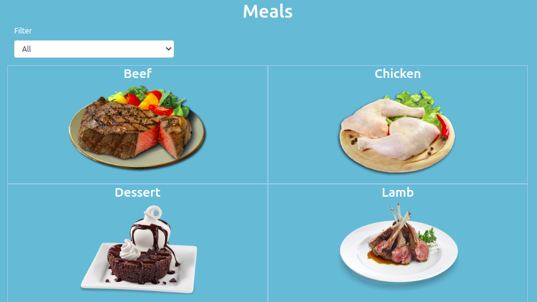

## React-Redux Capstone Project
This is a capstone project built using the [Meals DB](https://www.themealdb.com/api.php) API, React, Redux, CSS, and Bootstrap.

### Prerequisites
- npm 6.14.5
- node 14.3.0

### Setup

- Run $npm install   -to install all dependencies from a package.json file
- Run on the command line: $npm start
- You will see the project on broswer
- [http://localhost:3000](http://localhost:3000) to view it in the browser.

The page will reload if you make edits. 
You will also see any lint errors in the console.

## Built With

- React 16.13.1
- Redux 4.0.5
- React-Bootstrap 1.0.1
- Bootstrap 4.5.0
- Visual Code

## DevTools

- redux-devtools-extension 2.13.8

## Live Demo

[Live Demo Link](https://reactcapstonegon.herokuapp.com/)

### Prerequisites

- npm 6.14.5
- node 14.4.0

## Author:
👤 **Gonza Javier Mancilla**

- Github: [@gonjavi](https://github.com/gonjavi)
- Linkedin: [@g-javier-mancilla](https://www.linkedin.com/in/g-mancillla)

## 🤝 Contributing

Contributions, issues and feature requests are welcome!

## Show your support

Give a ⭐️ if you like this project!

## 📝 License

This project is [MIT](lic.url) licensed.
